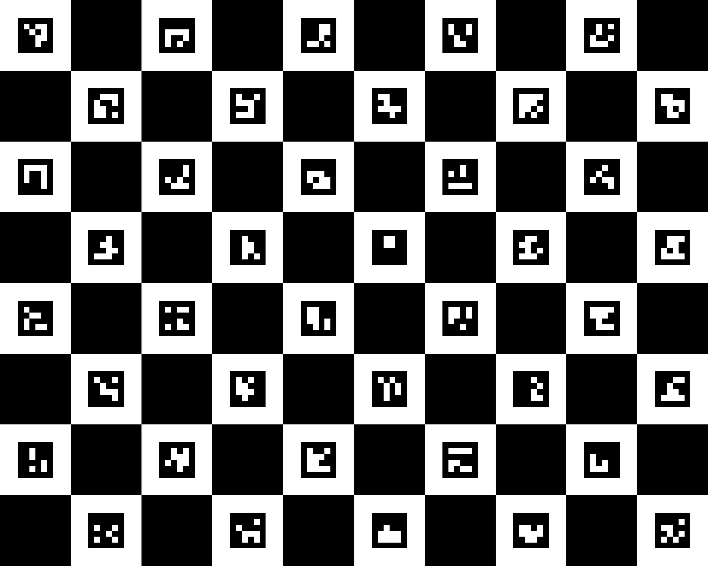

# CharucoCalibration

#### Usage
```
usage: charucoBoardCalibration.py [-h] [-f FILE] [-s SIZE] imgs [imgs ...]

optional arguments:
  -h, --help            show this help message and exit
  -f FILE, --file FILE  ouput calibration filename
  -s SIZE, --size SIZE  size of squares in meters
  -i IMAGES, --images   number of images for calibration
```
#### Example
```
python charucoBoardCalibration.py -f calibration.yml -s 0.035 imgs 01.jpg 02.jpg 03.jpg 04.jpg
```

#### Notes

Dictionary for the Charuco Board is Aruco DICT_4X4_50

##


# camera_calibration_with_charuco
